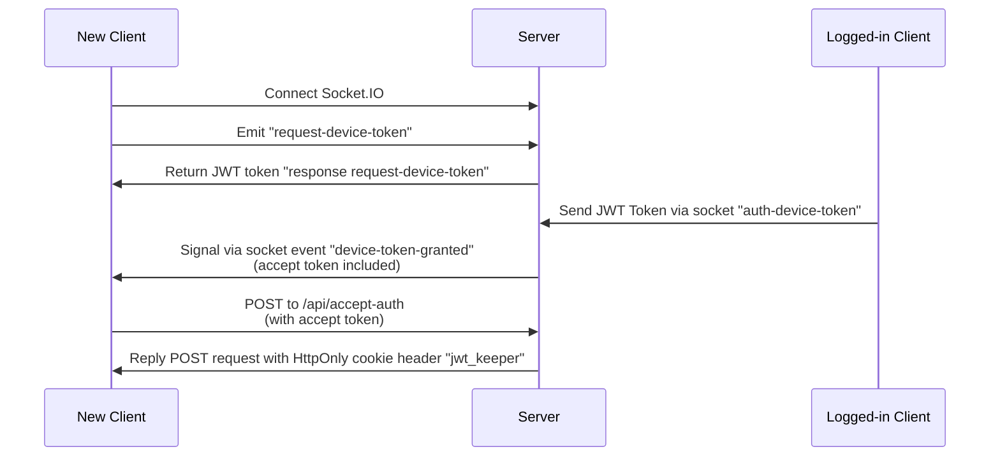

```mermaid
sequenceDiagram
    participant New Client
    participant Server
    participant Logged-in Client
    New Client->>Server: Connect Socket.IO
    New Client->>Server: Emit "request-device-token"
    Server->>New Client: Return JWT token "response request-device-token"
    Logged-in Client->>Server: Send JWT Token via socket "auth-device-token"
    Server->>New Client: Signal via socket event "device-token-granted"<br>(accept token included)
    New Client->>Server: POST to /api/accept-auth<br>(with accept token)
    Server->>New Client: Reply POST request with HttpOnly cookie header "jwt_keeper"
```